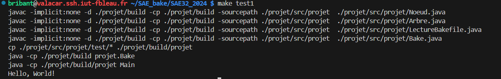
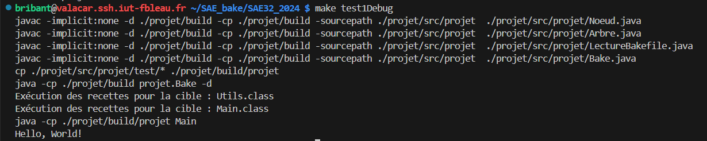

# Premier Test

## Présentation

Ce test est basique, il permet de tester le comportement du programme quand on veut compiler des fichiers depuis rien ; il n'y a aucun résultat préalable.

Les fichiers utilisés pour ce test sont Main.java, Utils.java et le Bakefile. Main est dépendant de Utils.


Pour lancer le test, faire la commande :

```
make test1
```

Si on veut le lancer avec l'option -d pour rajouter le débogage, faire la commande :

```
make test1Debug
```


## Résultats

### Sans le débogage




### Avec le débogage

