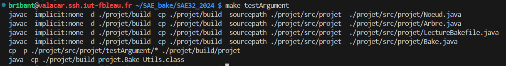
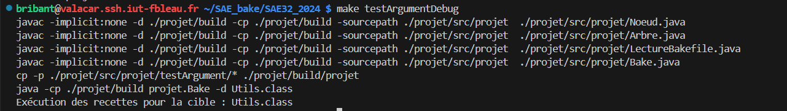

# Test avec un Argument

## Présentation

Ce test permet de tester le comportement du programme quand on lui passe un argument, soit tout seul, avec -d en plus pour voir le débogage. L'argument ajouté est "Utils.class".

Les fichiers utilisés pour ce test sont Main.java, Utils.java et le Bakefile. Main est dépendant de Utils.


Pour lancer le test, faire la commande :

```
make testArgument
```

Si on veut le lancer avec l'option -d pour rajouter le débogage, faire la commande :

```
make testArgumentDebug
```

## Résultats

### Sans le débogage




### Avec le débogage

