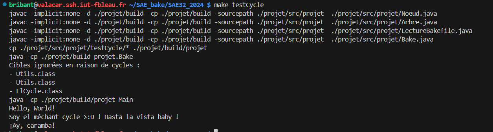
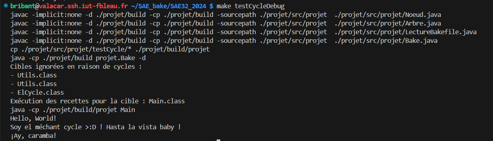

# Test avec une Dépendance Circulaire

## Présentation

Ce test permet de tester le comportement du programme quand il y a une dépendance circulaire dans le Bakefile.
Si le débogage est activé, il affiche en plus les cibles ignorées à cause du cycle.

Les fichiers utilisés pour ce test sont Main.java, Utils.java, ElCycle.java et le Bakefile.

Main.java est dépendant de Utils.java, qui est dépendant de ElCycle.java, qui est lui-même dépendant de Utils.java, ce qui créé une dépendance circulaire.


Pour lancer le test, faire la commande :

```
make testCycle
```

Si on veut le lancer avec l'option -d pour rajouter le débogage, faire la commande :

```
make testCycleDebug
```

## Résultats

### Sans le débogage




### Avec le débogage

