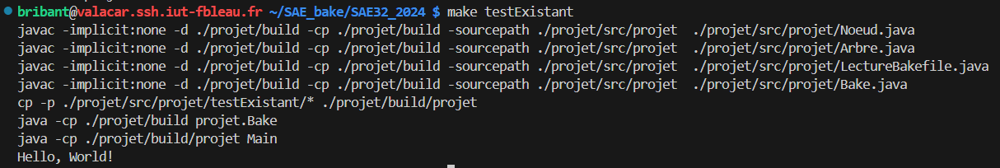
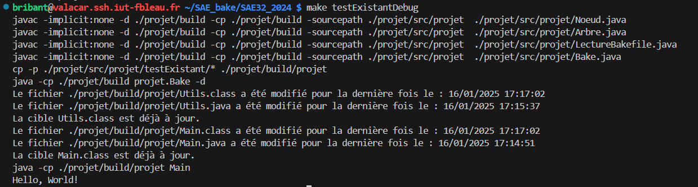

# Test avec les résultats de compilation déjà présents

## Présentation

Ce test permet de tester le comportement du programme quand les résultats de compilation (les fichiers .class) sont déjà présents, et qu'aucun fichier source n'a été mis à jour depuis la dernière compilation.

Si le débogage est activé, le programme affiche en plus la date a laquelle la dernière compilation a été faite, et la date de la dernière mise à jour des fichiers sources.

Les fichiers utilisés pour ce test sont Main.java, Utils.java, le Bakefile, et Main.class et Utils.class.


Pour lancer le test, faire la commande :

```
make testExistant
```

Si on veut le lancer avec l'option -d pour rajouter le débogage, faire la commande :

```
make testExistantDebug
```

## Résultats

### Sans le débogage




### Avec le débogage

