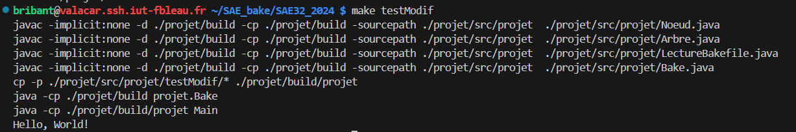

# Test où un résultat existe déjà, mais une source a été modifiée

## Présentation

Ce test permet de tester le comportement du programme quand les résultats de compilation (les fichiers .class) sont déjà présents, mais que l'un des fichiers sources a été mis à jour depuis la dernière compilation.

Si le débogage est activé, le programme affiche en plus la date a laquelle la dernière compilation a été faite, et la date de la dernière mise à jour des fichiers sources.

Les fichiers utilisés pour ce test sont Main.java, Utils.java, le Bakefile, et Main.class et Utils.class.
Le fichier source ayant été modifié après la compilation est le fichier Main.java.


Pour lancer le test, faire la commande :

```
make testModif
```

Si on veut le lancer avec l'option -d pour rajouter le débogage, faire la commande :

```
make testModifDebug
```


## Résultats

### Sans le débogage




### Avec le débogage

